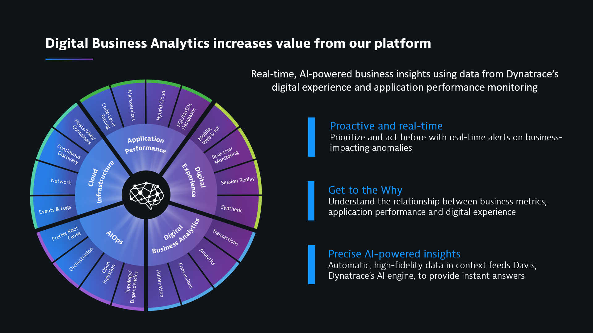

# Digital Business Analytic Dashboard Primer

## Prereqs:

1. The batch scripts uses Curl and Powershell. 
2. Add a session property for revenue if it applies for your application (**Applications->[Your App]->Edit->Session and User action prop**)
3. Generate a read/write token (**Settings->Integration->Dynatrace API->Generate Token**)
  
## What is Digital Business Analytics?



## How do I deploy the dashboards?

1.	Download a zip from this repo
2.	Unzip into any directory
3.	Create a cfg file with a 3-digit prefix (i.e. 313.cfg)
4.	Example:
  	```
    abc123.managed-sprint.dynalabs.io/e/1234567890abcdefg
  	yourlogin@corp.com
  	Book Travel
  	www.angular.easytravel.com
  	longProperties.income
  	Loading of page /easytravel/home
  	Home
  	/easytravel/rest/login
  	Login
  	/easytravel/rest/journeys/
  	Search
  	/easytravel/rest/validate-creditcard
  	Finish
    ```
5.	The cfg file contains the following fields (Tenant, Owner, Funnel Name, App Name (must match the naming rule for the App), revenue session property (use ```NOREVENUE``` if the app is not revenue generating), User Action name for first funnel step (can be the actual name or naming rule name), Header for first funnel step, … repeat for all funnel steps
6.	**Note:** You need a minimum of 3 funnel steps with a maximum of 12 funnel steps. My example above will create a 3-step funnel
7.	Open windows cmd prompt and CD to the directory where the files were unzipped
8.	Run ```DeployTenant.bat``` and pass in the following parameters
  * Token
  * 3-digit prefix you used to create the cfg
9.	For example, ```DeployTenant.bat 858585dhdh8 313```<br>
This will create a **Tenant Overview Dashboard, App Overview Dashboard, Funnel Overview Dashboard and many Funnel related Dashboards**. This step will also create a **Key Store Dashboard** that logged the TenantDeploy and all future deployments. This Dashboard can be accessed from the Tenant Overview Dashboard. This info is needed for future updates and keeps track of the 3-digit “keys” used in deployments.
 
## How do I deploy a second app to a tenant?

1.	Create a cfg file just like the tenant cfg above and give it a different 3-digit prefix
2.	Open windows cmd prompt and CD to the directory where the files were unzipped
3.	Run ```DeployApplication.bat``` and pass in the following parameters
  a.	Token
  b.	3-digit prefix you used to create the cfg file for the app
  c.	3-digit prefix you used in DeployTenant
  d.	Position number for App Overview link (2-11)
4.	For example, ```DeployApplication.bat 858585dhdh8 734 313 2```<br>
This will create an App Overview Dashboard and link it to the Tenant Overview Dashboard. It will also create a Funnel Overview Dashboard and many Funnel related Dashboards. It will also update the Key Store for the App deployment.

## How do I deploy a second funnel to an app?

1.	Create a cfg file just like the tenant cfg above and give it a different 3-digit prefix
2.	Open windows cmd prompt and CD to the directory where the files were unzipped
3.	Run ```DeployFunnel.bat``` and pass in the following parameters
  *	Token
  *	3-digit prefix you used to create the cfg file for the funnel
  *	3-digit prefix you used in DeployApplication
  *	Position number for Funnel Overview link (2-11)
4.	For example, ```DeployFunnel.bat 858585dhdh8 808 734 2```<br>
This will create a Funnel Overview Dashboard and link it to the Application Overview Dashboard. It will also create many Funnel related Dashboards. It will also update the Key Store for the Funnel deployment

## How do I change the time filters in the Comparison Dashboards?

1.	Open windows cmd prompt and CD to the directory where the files were unzipped
2.	Run ```UpdateTimeCompareDashboards.bat``` and pass in the following parameters
  *	Token
  *	3-digit prefix you used in DeployTenant/DeployApplication/DeployFunnel
  *	Compare hours (i.e. 12)<br>
This will update the Compare Dashboards for the Tenant/App/Funnel with a time filter of X in the upper half and X*2 in the bottom half of the Compare Dashboards. My example will filter the top tiles for last 12 hours and the bottom tiles with the previous 12 hours.

## How do I change the application name in the Comparison Dashboards so the top half shows one app and the bottom half shows a different app (i.e. A/B testing?
1.	Open windows cmd prompt and CD to the directory where the files were unzipped
2.	Run ```UpdateAppCompareDashboards.bat``` and pass in the following parameters
  *	Token
  *	3-digit prefix you used in DeployTenant/DeployApplication/DeployFunnel for the primary app (top half of dashboard)
  *	3-digit prefix you used in DeployTenant/DeployApplication/DeployFunnel for the secondary app (bottom half of dashboard)<br>
This will update the Compare Dashboards for the Tenant/App/Funnel with a time filter of X in the upper half and X*2 in the bottom half of the Compare Dashboards. My example will filter the top tiles for last 12 hours and the bottom tiles with the previous 12 hours.

## How do I integrate a Custom Dashboard into the Tenant Overview Dashboard?

1.  Create a cfg file with a 3-digit prefix (i.e. 313.cfg)
2.	Example:
  	Capacity Management
    ee73d6a8-6b19-4865-8c04-7176d1b9013d
3.	The cfg file contains the following fields (Dashboard Name, Dashboard ID)
4.  Run ```UpdloadCustom.bat``` and pass in the following parameters
  *	Token
  *	3-digit prefix you used to creatre the cfg file for the Custom Dashboard
  *	3-digit prefix you used in DeployTenant
  *	Position number for Funnel Overview link (2-11)<br>
This will update the Tenant Overview Dashboards with a link to the Custom Dashboard.
